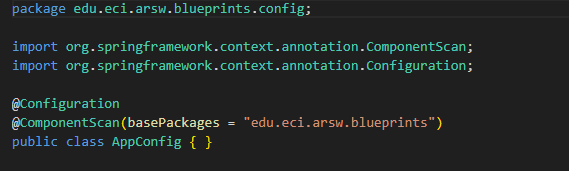

## Escuela Colombiana de Ingeniería

## Arquitecturas de Software

# Componentes y conectores - Parte I.

El ejercicio se debe traer terminado para el siguiente laboratorio (Parte II).

#### Middleware- gestión de planos.

## Antes de hacer este ejercicio, realice [el ejercicio introductorio al manejo de Spring y la configuración basada en anotaciones](https://github.com/ARSW-ECI/Spring_LightweightCont_Annotation-DI_Example).

En donde añadiremos las etiquetas:

y en donde lo inyectaremos:

En este ejercicio se va a construír un modelo de clases para la capa lógica de una aplicación que permita gestionar planos arquitectónicos de una prestigiosa compañia de diseño. 

1. Configure la aplicación para que funcione bajo un esquema de inyección de dependencias, tal como se muestra en el diagrama anterior.

	Lo anterior requiere:

	* Agregar las dependencias de Spring.

	En donde realizamos los siguientes ajustes:
	
	

	

	* Agregar la configuración de Spring.

	Agregamos la clase AppConfig

	

	* Configurar la aplicación -mediante anotaciones- para que el esquema de persistencia sea inyectado al momento de ser creado el bean 'BlueprintServices'.

	Añadimos los metodos a usar:

	

2. Complete los operaciones getBluePrint() y getBlueprintsByAuthor(). Implemente todo lo requerido de las capas inferiores (por ahora, el esquema de persistencia disponible 'InMemoryBlueprintPersistence') agregando las pruebas correspondientes en 'InMemoryPersistenceTest'.

En donde agregamos los metodos

y tambien las respectivas pruebas

3. Haga un programa en el que cree (mediante Spring) una instancia de BlueprintServices, y rectifique la funcionalidad del mismo: registrar planos, consultar planos, registrar planos específicos, etc.

en donde implementamos los metodos:

4. Se quiere que las operaciones de consulta de planos realicen un proceso de filtrado, antes de retornar los planos consultados. Dichos filtros lo que buscan es reducir el tamaño de los planos, removiendo datos redundantes o simplemente submuestrando, antes de retornarlos. Ajuste la aplicación (agregando las abstracciones e implementaciones que considere) para que a la clase BlueprintServices se le inyecte uno de dos posibles 'filtros' (o eventuales futuros filtros). No se contempla el uso de más de uno a la vez:
	* (A) Filtrado de redundancias: suprime del plano los puntos consecutivos que sean repetidos.
	* (B) Filtrado de submuestreo: suprime 1 de cada 2 puntos del plano, de manera intercalada.

	Para inyectar dichos filtros en BlueprintsService para que todas las consultas por autor, especifica y todas devuelva planos filtrados, por lo tanco creamos la interfaz:

	

	Filtro A en donde quitamos los puntos consecutivos repetidos

	

	Filtro B en donde suprime 1 de cada 2 puntos del plano de manera intercalada

	

	y se cambio el codigo de Blue printService de la siguiente manera para poder aplicar los filtors: 
	
	

5. Agrege las pruebas correspondientes a cada uno de estos filtros, y pruebe su funcionamiento en el programa de prueba, comprobando que sólo cambiando la posición de las anotaciones -sin cambiar nada más-, el programa retorne los planos filtrados de la manera (A) o de la manera (B). 

Se crearon los siguientes test:

